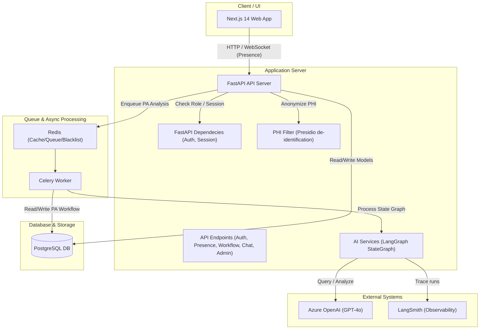
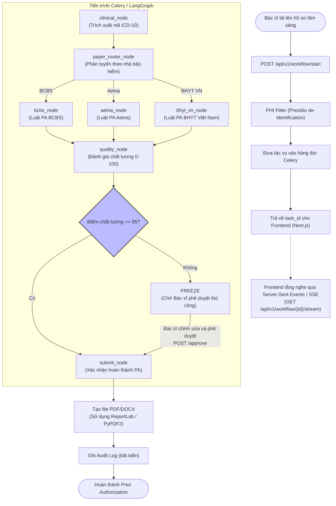
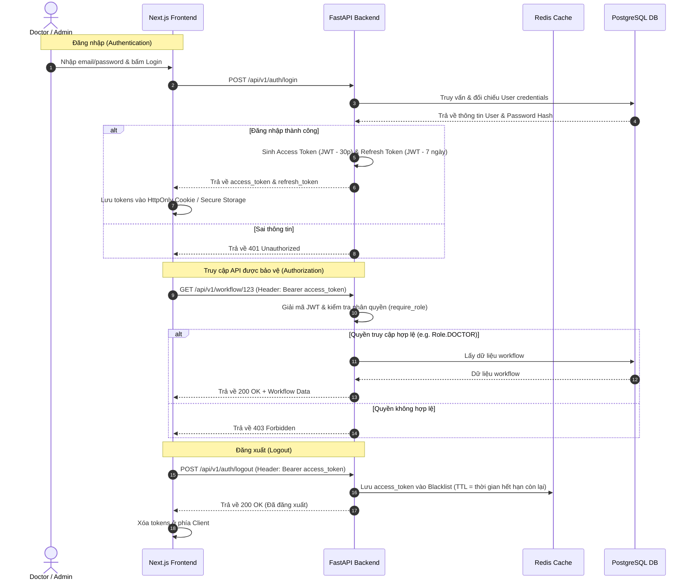
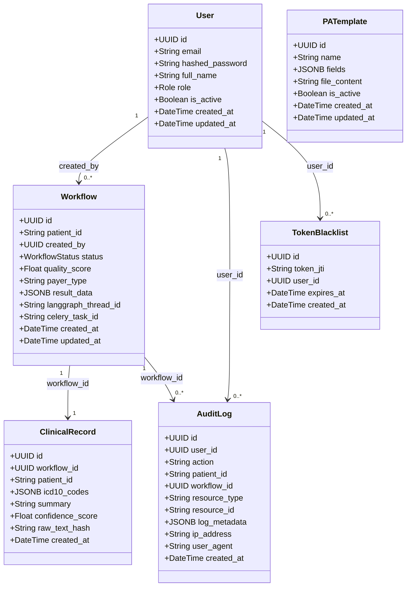

# Tài liệu Kiến trúc & Sơ đồ Logic Dự án PulseAI

Tài liệu này cung cấp các sơ đồ UML và mô tả chi tiết về logic hoạt động của hệ thống PulseAI (Prior Authorization AI System) phục vụ cho các lập trình viên và contributor mới tham gia dự án.

---

## 1. Sơ đồ Kiến trúc Thành phần (System Component Diagram)

Sơ đồ dưới đây biểu diễn các thành phần chính cấu thành nên hệ thống PulseAI và cách chúng tương tác qua các giao thức HTTP, WebSocket và hàng đợi tác vụ.

### Mô tả luồng tương tác:
1. **Frontend (Next.js)** tương tác với **FastAPI Backend** qua REST API và các kênh WebSocket để quản lý trạng thái hiện diện (presence tracking).
2. Khi có yêu cầu phân tích hồ sơ Prior Authorization (PA), FastAPI sẽ thực hiện lọc/ẩn danh dữ liệu PHI (Protected Health Information) bằng **Microsoft Presidio** (`phi_filter`).
3. Dữ liệu đã làm sạch được đưa vào hàng đợi **Redis** dưới dạng một task Celery không đồng bộ.
4. **Celery Worker** nhận nhiệm vụ và điều phối việc phân tích thông qua đồ thị trạng thái **LangGraph** (`services_ai`).
5. LangGraph giao tiếp với **Azure OpenAI (GPT-4o)** để đưa ra quyết định lâm sàng và lưu vết giám sát qua **LangSmith**.
6. Kết quả xử lý cuối cùng được ghi vào cơ sở dữ liệu **PostgreSQL**.

---

## 2. Luồng Xử lý Prior Authorization (PA Workflow Flowchart)

Sơ đồ này mô tả chi tiết hoạt động của một tiến trình xử lý hồ sơ yêu cầu Prior Authorization từ lúc bác sĩ tải dữ liệu lên đến khi sinh ra file PDF kết quả.

### Chi tiết các bước xử lý:
* **De-identification (Bảo mật HIPAA & TT46)**: Đảm bảo dữ liệu lâm sàng thô của bệnh nhân phải được ẩn danh trước khi chuyển đến bên thứ ba (Azure OpenAI).
* **LangGraph Nodes**:
  - `clinical_node`: Trích xuất thông tin lâm sàng và mã hóa thành mã ICD-10.
  - `payer_router_node`: Phân tích đơn vị chi trả bảo hiểm và điều hướng sang node xử lý tương ứng (`bcbs_node`, `aetna_node`, hoặc `bhyt_vn_node`).
  - `quality_node`: Chấm điểm chất lượng hồ sơ Prior Authorization. Nếu điểm dưới 95, hệ thống sẽ **Freeze** (tạm ngưng) và đưa vào trạng thái chờ duyệt thủ công bởi bác sĩ.
* **Human-in-the-loop**: Bác sĩ có thể chỉnh sửa các trường dữ liệu bị thiếu hoặc sai sót trên giao diện Next.js và nhấn duyệt thủ công để tiếp tục tiến trình.

---

## 3. Luồng Xác thực & Phân quyền (Authentication & Authorization Sequence)

Quy trình quản lý phiên làm việc bằng JSON Web Token (JWT) kết hợp với cơ chế Blacklist trên Redis để đăng xuất an toàn.

### Cơ chế bảo mật chính:
- **Role Hierarchy**: Quyền truy cập được quản lý thông qua trang trí router (Decorator) kiểm tra enum `Role` (`ADMIN`, `DOCTOR`, `VIEWER`).
- **Token Blacklisting**: Khi người dùng đăng xuất, Access Token sẽ bị đưa vào danh sách đen trên Redis cho đến khi hết hạn (TTL) để ngăn chặn tấn công replay.

---

## 4. Sơ đồ Quan hệ Cơ sở Dữ liệu (Database Schema / Domain Models)

PulseAI sử dụng kiến trúc Domain-Driven Design (DDD). Dưới đây là sơ đồ lớp UML biểu diễn các thực thể dữ liệu (định nghĩa tại thư mục `src-backend/app/domain/models/`).

### Các lớp thực thể (Domain Models) chi tiết:
* **User**: Lưu thông tin nhân viên bệnh viện và quyền hạn của họ (xem chi tiết tại [user.py](file:///Users/dothinhtpr247gmai.com/Desktop/PulseAi/src-backend/app/domain/models/user.py)).
* **Workflow**: Lưu thông tin tiến trình chạy Prior Authorization (xem chi tiết tại [workflow.py](file:///Users/dothinhtpr247gmai.com/Desktop/PulseAi/src-backend/app/domain/models/workflow.py)).
* **ClinicalRecord**: Bản ghi kết quả phân tích lâm sàng (lưu trong [workflow.py](file:///Users/dothinhtpr247gmai.com/Desktop/PulseAi/src-backend/app/domain/models/workflow.py)).
* **PATemplate**: Template mẫu Prior Authorization (xem chi tiết tại [pa_templates.py](file:///Users/dothinhtpr247gmai.com/Desktop/PulseAi/src-backend/app/domain/models/pa_templates.py)).
* **AuditLog (Bất biến)**: Nhật ký kiểm toán chỉ cho phép thêm (append-only), phục vụ cho việc tuân thủ đạo luật HIPAA và Thông tư 46 của Bộ Y tế Việt Nam (xem chi tiết tại [audit_log.py](file:///Users/dothinhtpr247gmai.com/Desktop/PulseAi/src-backend/app/domain/models/audit_log.py)).
