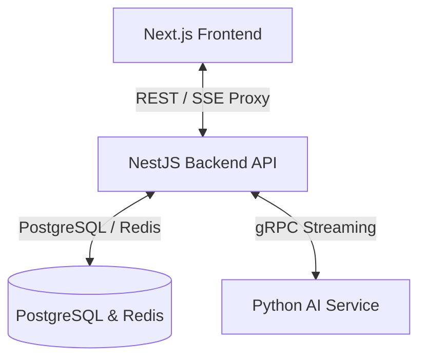

# Plan: Next.js + NestJS + Python gRPC AI Service Separation

## Overview
This plan outlines the separation of PulseAI into a 3-tier architecture to support high HIPAA/compliance requirements for hospitals.
1. **Frontend**: Next.js 14 App Router (TypeScript)
2. **Backend Gateway/API**: NestJS (TypeScript, owns PostgreSQL DB, auth, audit logging, workflow status)
3. **Core AI Service**: Python (Stateless, hosts LangGraph workflow, communicates via gRPC, performs PHI filtering)



- **OS**: macOS / Linux
- **Project Type**: WEB & BACKEND

---

## Success Criteria
- [ ] Next.js Frontend calls NestJS for all business logic, user auth, and workflow retrieval.
- [ ] NestJS manages the database, audit logging, and authorization.
- [ ] NestJS communicates with Python AI Service exclusively via gRPC.
- [ ] Python AI Service is stateless and does not query the database directly.
- [ ] Next.js Frontend streams real-time progress of the LangGraph workflow via a NestJS SSE endpoint that proxies Python's gRPC stream.
- [ ] HIPAA/BHYT compliance remains intact with MS Presidio PHI filtering active in Python before AI processing.

---

## Tech Stack
- **Frontend**: Next.js 14, React, TypeScript, Tailwind CSS
- **Backend API**: NestJS, Prisma/TypeORM, `@grpc/grpc-js` (gRPC client), `@nestjs/microservices`
- **Core AI**: Python 3.11+, `grpcio`, `grpcio-tools`, LangGraph, Microsoft Presidio
- **Database**: PostgreSQL 16, Redis 7 (caching/blacklisting)
- **Protobuf**: Protocol Buffers v3

---

## Proposed File Structure

```plaintext
PulseAi/
├── protos/
│   └── ai_service.proto         # Shared gRPC service contract
├── src-frontend/                # Next.js Frontend (existing)
├── src-backend-nestjs/          # NestJS Backend API (new)
│   ├── src/
│   │   ├── auth/                # JWT Auth, Roles
│   │   ├── audit/               # Immutable Audit Logs
│   │   ├── workflow/            # Workflow controller & gRPC/SSE logic
│   │   ├── database/            # Database context & schemas
│   │   └── main.ts
│   └── package.json
└── src-backend/                 # Python AI Service (refactored to gRPC server)
    ├── app/
    │   ├── protos/              # Generated gRPC Python code
    │   ├── services_ai/         # LangGraph & LLM nodes
    │   ├── domain/phi_filter.py # Microsoft Presidio PHI filter
    │   └── grpc_server.py       # gRPC Server entry point
    └── requirements.txt
```

---

## Task Breakdown

### [x] Task 1: Define gRPC Proto Contract
- **Agent**: `backend-specialist`
- **Skill**: `api-patterns`
- **Priority**: P0
- **Action**: Create `protos/ai_service.proto` to define:
  - `AnonymizeText` RPC (for PHI validation check).
  - `StartWorkflow` RPC returning a stream of `WorkflowEvent` (e.g., node entered, node completed, final score/result).
- **INPUT**: Current `src-backend/app/services_ai/` graph structure.
- **OUTPUT**: File `protos/ai_service.proto`.
- **VERIFY**: Run validation checking syntax `protoc --version`.

### [x] Task 2: Scaffold NestJS Backend Project
- **Agent**: `backend-specialist`
- **Skill**: `nodejs-best-practices`
- **Priority**: P0
- **Action**: Use `npx -y @nestjs/cli new src-backend-nestjs --skip-git --package-manager npm` to initialize the project, first checking options with `--help`.
- **INPUT**: Clean root directory.
- **OUTPUT**: Standard NestJS application in `src-backend-nestjs`.
- **VERIFY**: Run `npm run build` in `src-backend-nestjs`.

### [x] Task 3: Database Migration & Schema Setup in NestJS
- **Agent**: `database-architect`
- **Skill**: `database-design`
- **Priority**: P0
- **Action**: Setup Prisma or TypeORM in NestJS connecting to the PostgreSQL DB. Port models: `User`, `Workflow`, `ClinicalRecord`, `AuditLog` from current python codebase.
- **INPUT**: [ARCHITECTURE.md](file:///Users/dothinhtpr247gmai.com/Desktop/PulseAi/ARCHITECTURE.md) domain definitions.
- **OUTPUT**: Database migration files and NestJS database entities.
- **VERIFY**: Run test query to ensure tables are created correctly in PostgreSQL.

### [x] Task 4: Port JWT Auth and Audit Logs to NestJS
- **Agent**: `security-auditor`
- **Skill**: `vulnerability-scanner`
- **Priority**: P0
- **Action**: Implement JWT login, token verification, and an append-only Audit Logging service in NestJS.
- **INPUT**: Original python implementation of security/auth.
- **OUTPUT**: NestJS Auth guards and `AuditService`.
- **VERIFY**: Call `POST /auth/login` and verify JWT token payload.

### [x] Task 5: Refactor Python Backend to Stateless gRPC Server
- **Agent**: `backend-specialist`
- **Skill**: `python-patterns`
- **Priority**: P1
- **Action**: 
  - Install `grpcio` and `grpcio-tools`.
  - Compile the proto file using `python -m grpc_tools.protoc`.
  - Strip direct database dependencies (`SQLAlchemy`, `alembic`, config files for DB) from the Python codebase.
  - Implement the gRPC server in `src-backend/app/grpc_server.py` that executes the LangGraph workflow and streams node events.
- **INPUT**: Existing Python code in `src-backend/app/`.
- **OUTPUT**: Stateless Python gRPC server running on port 50051.
- **VERIFY**: Start python gRPC server and test with a gRPC CLI tool (e.g. `grpcurl`).

### [x] Task 6: Implement gRPC Client and SSE Controller in NestJS
- **Agent**: `backend-specialist`
- **Skill**: `api-patterns`
- **Priority**: P1
- **Action**: 
  - Setup NestJS microservice gRPC client.
  - Create `WorkflowController` with `POST /api/v1/workflow/start` (returns workflow ID and persists record).
  - Create `GET /api/v1/workflow/:id/stream` that returns a Server-Sent Event (SSE) stream, calling Python's gRPC stream, forwarding events in real-time, and updating the database state upon workflow completion.
- **INPUT**: NestJS gRPC configuration.
- **OUTPUT**: SSE controller working with gRPC stream mapping.
- **VERIFY**: Curl endpoint `GET /api/v1/workflow/123/stream` and check SSE chunks.

### Task 7: Update Frontend Client Integrations
- **Agent**: `frontend-specialist`
- **Skill**: `nextjs-react-expert`
- **Priority**: P2
- **Action**: Update Next.js API calls to point to the new NestJS backend (port 3001) instead of FastAPI (port 8000). Ensure Auth tokens and SSE streams map correctly.
- **INPUT**: Next.js API layer.
- **OUTPUT**: Functional UI linked to NestJS.
- **VERIFY**: Log in from frontend, trigger prior authorization, and observe the real-time progress stream.

### Task 8: Docker Compose Coordination
- **Agent**: `devops-engineer`
- **Skill**: `deployment-procedures`
- **Priority**: P2
- **Action**: Update `docker-compose.yml` and `docker-compose.prod.yml` to run `src-backend-nestjs`, `src-backend` (as `ai-service`), `src-frontend`, PostgreSQL, and Redis.
- **INPUT**: Root `docker-compose.yml`.
- **OUTPUT**: Configured orchestration for local development.
- **VERIFY**: Run `docker compose up --build` and verify all services start and link correctly.

---

## Phase X: Verification Checklist

### 1. Master Security Scan
- Run vulnerability scanner:
  ```bash
  python .agents/skills/vulnerability-scanner/scripts/security_scan.py src-backend-nestjs
  ```
- Ensure TLS 1.3 is configured for production gRPC and HTTP links.

### 2. NestJS and Python Linting
- Ensure all NestJS files build and pass types:
  ```bash
  cd src-backend-nestjs && npm run lint && npx tsc --noEmit
  ```
- Lint Python AI service files:
  ```bash
  cd src-backend && flake8 app/
  ```

### 3. End-to-End Test Suite
- Run Playwright E2E checks:
  ```bash
  python .agents/skills/webapp-testing/scripts/playwright_runner.py http://localhost:3000 --screenshot
  ```

### 4. Audit Log Verifiability
- Run a transaction and check that the `AuditLog` table has append-only entries showing:
  - User ID initiating the workflow.
  - Status updates mapped to LangGraph nodes.
  - Final approval score.
- Ensure no delete/update permissions are allowed on the `AuditLog` table.
